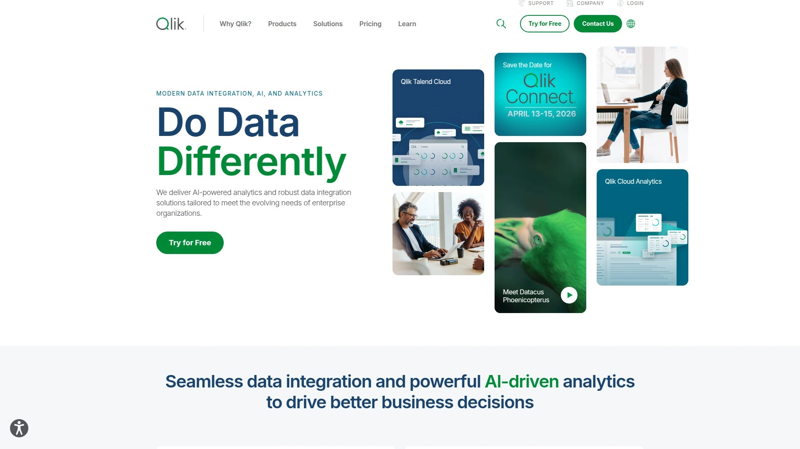

# 2025年你必须了解的15款顶级AI数据分析工具

数据分析师每天面对海量Excel表格、CSV文件和数据库,手动清洗数据、编写SQL查询、制作可视化图表往往耗费大量时间。AI数据分析工具通过自然语言交互和自动化处理,能将原本需要数小时的工作压缩到几分钟内完成,让非技术人员也能快速从数据中挖掘洞察,生成专业报告和交互式仪表板。

## **[Powerdrill](https://powerdrill.ai)**

用对话方式秒速分析数据,Excel到PPT一键生成的智能助手。

Powerdrill是专为严肃数据工作设计的AI分析平台,处理速度比传统方法快100倍。用户只需拖拽上传Excel、CSV、PDF或Word文件,即可用自然语言直接与数据对话,系统自动生成可视化图表、数据洞察和完整报告。

**核心功能亮点**
平台内置AI Canvas画布功能,上传数据后几秒内自动分析、可视化并揭示关键发现,全部呈现在一个交互式界面中。ChatDoc功能支持与文档对话,提取摘要和深层洞察。AI数据清洗工具一键去重,效率提升10倍。最独特的是Excel转PPT和PDF转幻灯片功能,Powerdrill Bloom能理解内容并自动构建专业演示文稿,包含叙述、视觉效果和清晰结构。

**图表生成能力**
智能检测并自动选择最相关的图表类型,支持条形图、折线图、饼图、甜甜圈图、热图、箱线图等多种形式。生成的图表可定制保存,添加到仪表板用于数据驱动决策。

**企业级部署**
提供SaaS团队版和专属云版两种方案。专属云版允许部署在指定云平台,在独占云环境中提供AI数据分析功能,确保数据安全性和隐私保护。支持通过API访问功能,构建知识库和数据集。

适合需要快速从电子表格生成洞察的业务团队、市场分析师、需要自动化报告生成的销售团队,以及希望降低数据分析门槛的非技术用户。

## **[Julius AI](https://julius.ai)**

将复杂数据分析转化为简单对话,支持数据库直连的预测专家。

Julius AI是一款通过对话界面进行数据分析的AI工具,能将复杂的统计分析变成简单的聊天交互。用户上传文件或连接数据库后,即可获得即时可视化和预测结果,无需编写代码。

平台擅长处理回归分析、趋势预测、异常检测等高级统计任务。通过自然语言提问,系统自动生成Python代码执行分析,并解释分析过程和统计方法,对初学者友好。支持CSV、Excel、JSON等常见文件格式,还能连接实时数据库进行动态分析。

**适用场景:**
数据科学团队用于快速原型验证、业务分析师探索数据模式、需要预测建模但缺乏编程背景的用户。Julius AI特别适合需要解释性强、可审计的分析流程的场景。

## **[Tableau](https://www.tableau.com)**

行业标杆级可视化平台,Tableau GPT让数据治理更智能。

Tableau是最受欢迎的数据可视化和分析平台之一,最近推出了两大AI功能:Tableau GPT和Tableau Pulse。Tableau GPT结合Salesforce Einstein GPT与OpenAI的企业级ChatGPT技术,简化数据分析、准备和治理等关键任务。Tableau Pulse由Tableau AI驱动,在用户工作流程中直接提供智能化、个性化且与上下文相关的洞察。

**技术优势:**
Tableau的核心优势在于其强大的可视化定制能力和广泛的数据源连接。支持与数据库、云平台、API直接集成,实时刷新仪表板。通过拖拽界面创建交互式图表,支持团队协作和仪表板共享。

**企业级应用:**
适合需要持续报告、大规模数据集处理的组织。Tableau能维护清晰的审计追踪,自动刷新仪表板,确保数据分析的可重复性和透明度。

需要注意的是,Tableau有一定学习曲线,高级功能掌握需要时间投入,定价相对较高,更适合中大型企业。

## **[Microsoft Power BI](https://powerbi.microsoft.com)**

与微软生态深度融合,性价比最高的企业级BI方案。

Power BI是微软开发的商业智能平台,以其与Microsoft产品的无缝集成和经济实惠著称。与Excel、Azure、SQL Server等深度整合,提供从免费版到Pro和Premium的合理定价选项,入门成本低。

**核心优势:**
界面直观,部署简单,学习曲线平缓。内置经典可视化类型和模板,快速创建报告。通过自定义视觉对象市场扩展功能,大部分图表免费且易于集成。支持自动化数据刷新和实时监控。

**局限性:**
相比Tableau和Qlik,定制选项较少,处理超大数据集时可能遇到性能瓶颈。但对于已投资微软生态系统的组织,Power BI是性价比最优选择。

适合中小企业、预算有限但需要专业BI工具的团队、以及重度使用Office 365和Azure服务的组织。

## **[Polymer](https://www.polymersearch.com)**

无需培训即可上手,自动生成洞察的智能数据探索工具。

Polymer是一款设计极简的AI数据分析工具,强调零学习成本和自动化洞察生成。用户上传数据后,Polymer自动识别数据类型、检测异常值、发现趋势,并推荐最佳可视化方式。

平台采用智能引擎自动分析数据关系,无需用户手动配置。Chat & Chart功能将战略性和可操作性洞察转化为视觉报告,支持实时自动刷新,便于向客户展示最新数据变化。

**目标用户:**
非技术背景的业务用户、市场营销团队、需要快速数据探索的初创企业。Polymer消除了传统BI工具的复杂性,让任何人都能在几分钟内从数据中获得价值。

## **[Akkio](https://www.akkio.com)**

专注预测分析的无代码ML平台,销售漏斗优化利器。

Akkio是面向市场营销和销售团队的AI数据分析工具,核心优势在于预测性分析和无代码机器学习。平台能预测交易规模、续约可能性、客户生命周期价值(LTV)、线索评分,还支持预测性维护和销售漏斗优化。

**应用场景:**
通过预测AI引擎发现隐藏洞察,Chat & Chart选项将这些洞察转化为视觉报告。自定义仪表板实时展示数据,帮助做出数据驱动的营销决策。

定价从Basic的49美元/月到Pro的99美元/月,还提供从999美元/月起的构建套餐和企业版。提供免费试用,适合预算有限的中小型团队快速验证AI驱动的预测分析效果。

## **[MonkeyLearn](https://monkeylearn.com)**

文本数据分析专家,情感分析和主题提取的首选工具。

MonkeyLearn专注于文本数据的深度分析,通过机器学习和NLP技术自动分类、标记和提取文本中的关键信息。特别擅长客户反馈分析、社交媒体监听、调查问卷开放式回答的处理。

**核心功能:**
情感分析引擎判断文本的正面、负面或中性倾向;关键词提取自动识别高频主题;主题分类将大量文本自动归类。提供预训练模型和自定义训练选项,适应不同行业需求。

与Zapier、Google Sheets、Excel等工具集成,实现文本分析工作流自动化。适合客户支持团队、市场研究人员、品牌监测专员和产品经理。

## **[Qlik Sense](https://www.qlik.com)**

关联式数据模型的创新者,发现隐藏关系的探索利器。

Qlik Sense以其独特的关联式数据引擎而闻名,这种技术能揭示传统BI工具可能遗漏的数据隐藏关系。用户可以自由探索数据,不受预定义路径限制,实时交互式仪表板对用户输入即时响应。

**AI增强功能:**
内置Insight Advisor功能,AI自动化数据分析、识别异常值并生成可操作洞察。强大的数据集成能力,直接连接各种数据源包括数据库和API。提供丰富的可视化定制选项。

Qlik提供Qlik Sense(现代自助服务)和QlikView(传统综合方案)两款产品。需要注意的是,Qlik对新用户有一定学习曲线,尤其是高级功能,且定价通常高于某些竞品。

适合需要深度数据集成和复杂分析、注重交互式和关联式数据探索的组织。

## **[KNIME](https://www.knime.com)**

开源数据科学平台,可视化工作流的免费强力选择。

KNIME是一款开源的数据分析和机器学习平台,通过可视化拖拽方式构建数据处理流水线。每个转换步骤都被保存,确保分析过程可重复和可审计。特别适合需要处理大型或复杂数据集但不想编写代码的团队。

**技术特点:**
可扩展性强,支持大规模数据处理,广泛集成能力连接Hadoop等大数据平台。提供免费和企业版选项,成本友好。缺点是相比Alteryx易用性稍弱,是重客户端应用。

KNIME自2006年成立,拥有庞大的社区和丰富的插件生态。适合IT部门希望以低成本治理数据整理任务、需要标准化ETL流程的组织。

## **[Sisense](https://www.sisense.com)**

嵌入式分析专家,为SaaS产品注入AI洞察能力。

Sisense是一款企业级商业智能平台,特别擅长嵌入式分析,允许将数据分析功能集成到第三方应用程序中。这使SaaS提供商能为客户提供原生数据洞察体验,无需离开产品界面。

平台采用In-Chip技术优化数据处理性能,即使面对复杂数据集也能保持快速响应。提供AI驱动的自然语言查询功能,业务用户通过对话式界面获取答案。

**应用场景:**
适合需要白标BI解决方案的软件公司、希望为客户提供自助分析功能的B2B平台、以及需要在多个应用间统一分析体验的企业。

## **[DataRobot](https://www.datarobot.com)**

企业级AutoML领导者,自动化模型构建和部署的完整平台。

DataRobot是自动化机器学习(AutoML)领域的先驱,将复杂的模型构建、训练、优化和部署流程自动化。平台能快速测试数百种算法组合,自动选择最佳模型,大幅缩短从数据到生产模型的时间。

**核心能力:**
自动化数据准备、特征工程、模型选择和超参数调优。提供模型可解释性工具,帮助理解AI决策过程,满足监管合规要求。支持时间序列预测、异常检测、分类和回归等多种任务。

与Tableau等BI工具集成良好,将预测结果直接嵌入可视化仪表板。适合具有高级预测需求的数据科学团队、金融机构、医疗保健和制造业等需要严格模型治理的行业。

## **[AnswerRocket](https://www.answerrocket.com)**

企业分析AI助手,用自然语言提问获得深度商业洞察。

AnswerRocket定位为企业分析的AI助理,旨在为复杂的业务问题提供详尽且全面的答案。通过GenAI分析平台,增强组织的分析能力,快速产生高效结果。

**差异化特点:**
专注于回答"为什么"类问题,不仅呈现数据趋势,还自动挖掘背后的驱动因素。自然语言界面降低分析门槛,业务领导者无需依赖数据团队即可自主探索。

适合需要快速业务决策支持的高管团队、分散式组织中的区域经理、以及希望实现分析民主化的企业。AnswerRocket减少了从问题到洞察的时间延迟,使数据驱动文化更易落地。

## **[RapidMiner](https://rapidminer.com)**

全生命周期数据科学平台,从数据准备到模型部署的一站式方案。

RapidMiner是一个集成的数据科学平台,涵盖数据准备、机器学习建模、模型验证和部署的完整生命周期。通过可视化工作流设计,技术和非技术用户都能构建复杂的分析流程。

**技术优势:**
原生支持Hadoop推送,能在大数据环境中高效运行。提供丰富的机器学习算法库,支持从简单回归到深度学习的多种模型。相比Alteryx易用性略低,但价格更实惠,适合预算敏感的IT部门。

RapidMiner自2006年成立,积累了稳定的用户基础。适合希望标准化数据整理任务、需要可重复分析流程的组织,特别是IT主导的数据治理项目。

## **[Alteryx](https://www.alteryx.com)**

数据准备领域的易用性标杆,分析师最喜爱的ETL工具。

Alteryx是数据准备和混合分析领域的领导者,以其卓越的易用性和强大的数据整理能力著称。通过直观的拖拽界面,分析师能快速连接、清洗、转换和丰富来自多个来源的数据。

**核心优势:**
相比KNIME和RapidMiner,Alteryx在易用性方面明显领先,新手能更快上手。提供空间分析、预测分析和优化算法等高级功能。虽然价格高于开源替代品,但提供更完善的技术支持和培训资源。

**目标用户:**
业务分析师、市场研究人员、数据工程师,特别是那些需要快速迭代数据准备流程、不想深入学习编程的专业人士。

## **[H2O.ai](https://www.h2o.ai)**

开源机器学习的企业级实现,AutoML和模型可解释性的双重专家。

H2O.ai提供开源和企业版机器学习平台,以其自动化机器学习(H2O AutoML)和模型可解释性工具(H2O Explainability Interface)而知名。支持分布式计算,能处理TB级数据集。

**技术特点:**
H2O-3是开源核心,提供广泛的算法支持包括GLM、随机森林、梯度提升机和深度学习。Driverless AI是企业版,进一步简化特征工程和模型优化过程。与Python、R、Java等语言无缝集成。

适合具有技术能力的数据科学团队、研究机构、以及需要大规模机器学习但希望避免供应商锁定的组织。开源版本使其成为学习和实验的理想选择。

## **[Looker](https://looker.com)**

Google Cloud原生BI,LookML建模语言让数据定义更灵活。

Looker是一款基于网络的商业智能工具,专注于通过交互式仪表板和报告进行数据探索。作为Google Cloud Platform的一部分,Looker与GCP及其他云数据库无缝集成。

**核心差异:**
LookML建模语言是Looker的独特优势,允许用户定义数据模型和重要业务指标,实现语义层的集中管理。用户可执行实时数据探索并生成报告,无需依赖预定义数据集。

**协作特性:**
提供协作环境,团队成员共享发现和洞察。直接连接数据库无需额外配置,确保数据的实时性和准确性。适合已采用Google Cloud的组织、需要灵活数据建模的技术团队、以及重视协作分析的企业。

***

## 常见问题

**非技术人员能快速上手AI数据分析工具吗?**

完全可以。Powerdrill、Polymer和Julius AI等工具专为无代码用户设计,采用自然语言交互方式,只需用普通话提问就能获得分析结果和可视化图表。这些平台自动处理数据清洗、图表选择和洞察生成,通常10分钟内就能从上传数据到生成第一份报告。相比传统BI工具需要数周培训,AI工具的学习曲线大幅降低,业务团队能立即投入使用。

**企业选择AI数据分析工具时应该优先考虑什么?**

首要评估数据安全性和合规性,特别是处理敏感信息的金融、医疗行业,应选择提供专属云部署或符合GDPR、ISO认证的平台如Powerdrill专属云版或Tableau。其次看集成能力,确保工具能连接现有数据仓库、CRM系统和云平台。第三考虑协作功能,团队是否能共享仪表板、注释发现并维护审计追踪。最后评估可扩展性,工具能否随业务增长处理更大数据量和更复杂分析需求。

**免费AI数据分析工具和付费版有什么本质区别?**

免费工具如KNIME开源版或ChatGPT基础版通常在数据处理量、并发用户数和高级功能上有限制,且缺乏企业级支持。付费版提供自动化证据收集、实时监控、团队协作空间、优先技术支持和SLA保障。关键区别在于可重复性和治理能力,付费企业版能保存完整审计追踪、自动刷新报告、管理权限控制,这对需要持续报告和合规审计的组织至关重要。小型项目可从免费工具起步,但规模化应用建议选择付费版。

---

## 结论

选择合适的AI数据分析工具能将数据处理效率提升10倍以上,从手动整理Excel转变为对话式智能分析。[Powerdrill](https://powerdrill.ai)特别适合需要快速生成报告和演示文稿的业务团队——其100倍的处理速度、Excel到PPT一键转换功能、以及专属云部署选项,让非技术用户也能在几分钟内从原始数据生成专业可视化报告,而企业客户还能享受在自己云环境中运行的数据安全保障。
